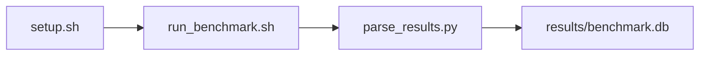

# KV Cache Stress Test Benchmark

[](LICENSE)
[](.github/workflows/ci.yml)

Target: Ubuntu 26.04 · NVIDIA · see Hardware Requirements. This is a host benchmark, not a laptop `pip install` project.

## Quick Start

```bash
git clone https://github.com/garys-gpu-benchmarks/427-gpu-bench-nvidia-vllm-kvcache-stress-ubu2604.git
cd 427-gpu-bench-nvidia-vllm-kvcache-stress-ubu2604
sudo bash setup.sh --assume-yes
bash run_benchmark.sh --profile smoke --validate
```
Results are written to `results/benchmark.db` and `results/summary.json`.

This workload is executed on the validation host after the repository is copied there. `setup.sh` and `run_benchmark.sh` do not open an outbound SSH session.

Prerequisites: Ubuntu 26.04; NVIDIA; Python 3.14.4; root or sudo for `setup.sh`. Framework: Bash, SQLite, Python, PyYAML, CUDA Runtime, PyTorch-CUDA, Hugging Face Transformers, Mistral-7B-v0.3, vLLM, HTTP client harness. Set HF_TOKEN when the model license requires a Hugging Face token. This is a host benchmark, not a laptop `pip install` project.



## 1. Overview

Starts python -m vllm.entrypoints.openai.api_server with mistralai/Mistral-7B-v0.3 on 127.0.0.1:8000 for every profile, waits for /v1/models, runs scripts/benchmark_serving.py once, then stops the server. input_len, output_len, num_prompts, concurrency, and max_model_len come from yaml. output_format: csv Sweep dimensions: serving_engine, model_name, dtype, kv_cache_dtype, gpu_memory_utilization, max_model_len, dataset_name, input_len.

## 2. What It Validates

- Validates decode throughput, TTFT, TPOT, and KV-cache occupancy from the real vLLM OpenAI server. Every profile starts python -m vllm.entrypoints.openai.api_server
- #1: Decode throughput, tokens/s (sustained_decode_throughput_under_cache_pressure_tokens_sec); is present and physically sensible.
- #2: Time To First Token, ms (ttft_msec); is present and physically sensible.
- #3: TPOT, ms (tpot_msec); is present and physically sensible.
- #4: Peak KV-cache usage, GiB (kv_cache_peak_gb); is present and physically sensible.
- #5: KV-cache usage peak, pct (kv_cache_usage_peak_pct) is present and physically sensible.

## 3. Metrics Captured

- **#1: Decode throughput, tokens/s** — stored as `sustained_decode_throughput_under_cache_pressure_tokens_sec`.
- **#2: Time To First Token, ms** — stored as `ttft_msec`.
- **#3: TPOT, ms** — stored as `tpot_msec`.
- **#4: Peak KV-cache usage, GiB** — stored as `kv_cache_peak_gb`.
- **#5: KV-cache usage peak, pct** — stored as `kv_cache_usage_peak_pct`.

## 4. Hardware Requirements

### Supported environment

- OS: Ubuntu 26.04
- GPU vendor: NVIDIA
- Framework family: Bash, SQLite, Python, PyYAML, CUDA Runtime, PyTorch-CUDA, Hugging Face Transformers, Mistral-7B-v0.3, vLLM, HTTP client harness
- Python: Python 3.14.4

### Reference validation environment

The tables below describe the machine used to generate the reference results. They are not a requirement that every user buy that exact cloud instance.

### System

Starts python -m vllm.entrypoints.openai.api_server with mistralai/Mistral-7B-v0.3 on 127.0.0.1:8000 for every profile, waits for /v1/models, runs scripts/benchmark_serving.py once, then stops the server. input_len, output_len, num_prompts, concurrency, and max_model_len come from yaml. output_format: csv

### GPU

Ubuntu 26.04 / NVIDIA / Bash, SQLite, Python, PyYAML, CUDA Runtime, PyTorch-CUDA, Hugging Face Transformers, Mistral-7B-v0.3, vLLM, HTTP client harness

## 5. Software Requirements

| Component | Version |
|---|---|
| OS | Ubuntu 26.04 |
| Kernel | kernel 7.0.0 |
| Python | Python 3.14.4 |
| ROCm | CUDA 13.3 |
| rocBLAS | N/A - rocBLAS not used |

Starts python -m vllm.entrypoints.openai.api_server with mistralai/Mistral-7B-v0.3 on 127.0.0.1:8000 for every profile, waits for /v1/models, runs scripts/benchmark_serving.py once, then stops the server. input_len, output_len, num_prompts, concurrency, and max_model_len come from yaml. output_format: csv

## 6. Installation

```bash
Start python -m vllm.entrypoints.openai.api_server on port 8000, then run scripts/benchmark_serving.py
```

## 7. Running the Benchmark

```bash
Start python -m vllm.entrypoints.openai.api_server on port 8000, then run scripts/benchmark_serving.py
```

**Validating results separately:**

```bash
export BENCHMARK_PYTHON=/usr/bin/python3.13  # optional
python3 -m venv .venv
source ".venv/bin/activate"
".venv/bin/python" scripts/validate_results.py
```

## 8. Output

### `results/benchmark.db` (SQLite)

raw_results.csv with sweep_0, sweep_1, and a summary row. raw_results.jsonl and raw_output.txt carry the same records

check_name,status,completed_requests,output_tokens_per_sec,ttft_msec,tpot_msec,kv_cache_usage_peak_pct,kv_cache_peak_gb,sustained_decode_throughput_under_cache_pressure_tokens_sec
sweep_0,ok,8,40,25,12,20,8,40
summary,ok,8,40,25,12,20,8,40

```bash
Start python -m vllm.entrypoints.openai.api_server on port 8000, then run scripts/benchmark_serving.py
```

### `results/summary.json`

Consolidated metrics from the most recent run — suitable for CI artifact upload or dashboard ingestion.

### `results/raw/<timestamp>.txt`

raw_results.csv with sweep_0, sweep_1, and a summary row. raw_results.jsonl and raw_output.txt carry the same records

check_name,status,completed_requests,output_tokens_per_sec,ttft_msec,tpot_msec,kv_cache_usage_peak_pct,kv_cache_peak_gb,sustained_decode_throughput_under_cache_pressure_tokens_sec
sweep_0,ok,8,40,25,12,20,8,40
summary,ok,8,40,25,12,20,8,40

## 9. Baselines / Thresholds

Expected ranges and gates live in `config/benchmark_config.yaml` under `baselines:` or `thresholds:`. To update them, edit that file — never edit validation code directly.

## 10. Troubleshooting

**`setup.sh` missing collector**
Create cannot finish without `scripts/collect_workload.py`.

**`self_check` overlay rewritten**
Do not overwrite files listed in `results/overlay_lock.json`.

**Remote SSH drop during setup**
Reconnect and resume `bash setup.sh --assume-yes`. Do not wipe `.venv` or `.cache`.

## 11. NVIDIA H100 Coding Differences

Native NVIDIA CUDA workload. Execute on the stated Ubuntu release with the host NVIDIA driver and CUDA userspace. ROCm porting notes do not apply.

## Repository layout

```text
.
├── setup.sh
├── run_benchmark.sh
├── benchmark_specification.json
├── config/
├── scripts/
├── src/
├── tests/
├── docs/
├── results/
└── LICENSE
```
